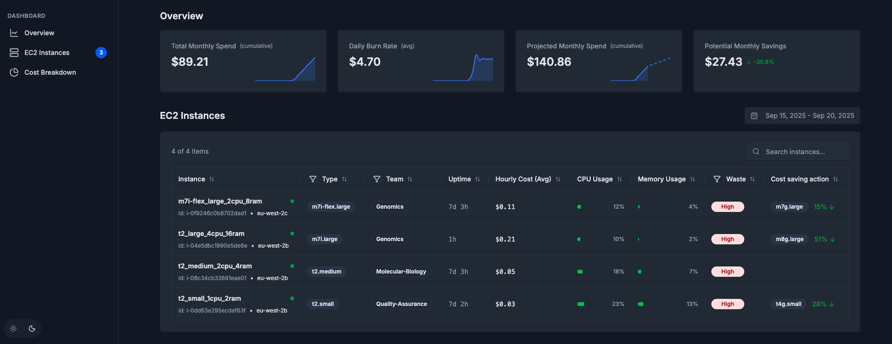

# CloudTracer Demo

A Next.js observability tool for AWS EC2 instances with cost optimization insights.

##### Check out the demo [here](https://aws-ec2-dashboard.vercel.app/)!

## Screenshots

<div align="center" style="margin-bottom: 16px">
  
  
</div>

<div align="center">
  
</div>

## Local Setup

1. Install dependencies:

```bash
npm install
```

2. Set up environment variables:

```bash
mv .env.example .env.local
```

3. Update AWS credentials in `.env.local`:

```bash
AWS_ACCESS_KEY_ID=your_access_key
AWS_SECRET_ACCESS_KEY=your_secret_key
AWS_REGION=your_region
```

4. Run the development server:

```bash
npm run dev
```

Open [http://localhost:3000](http://localhost:3000) to view the application.
