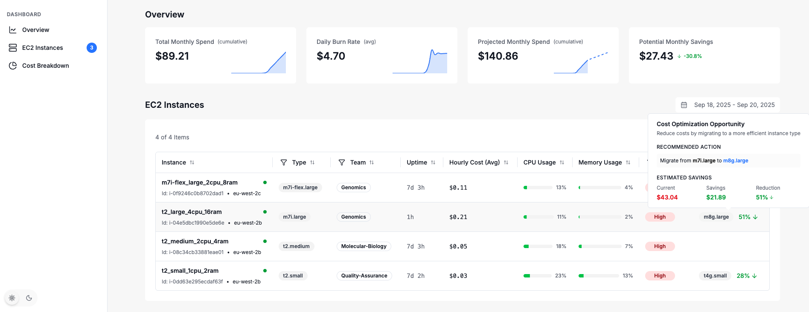
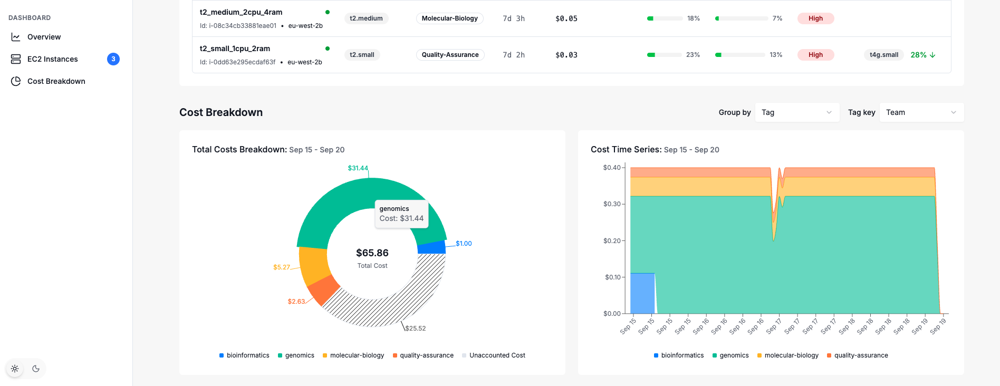
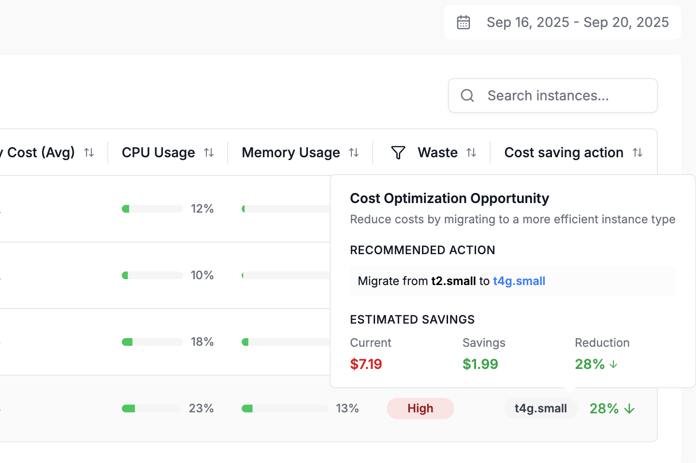
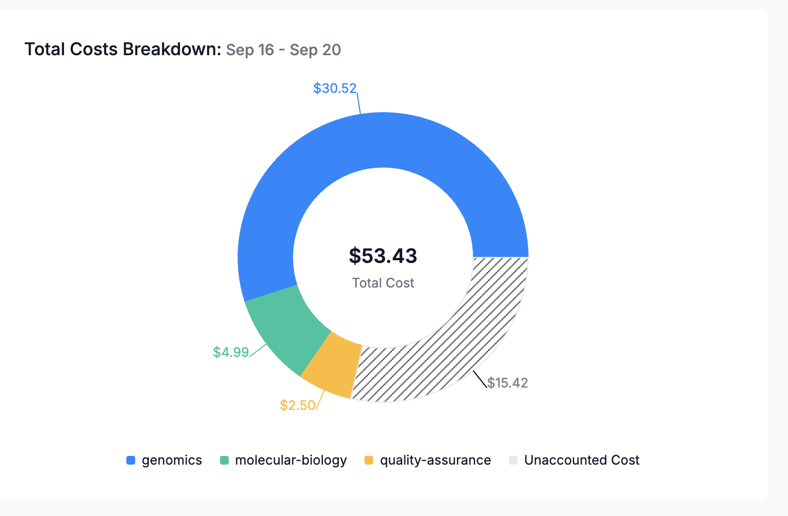
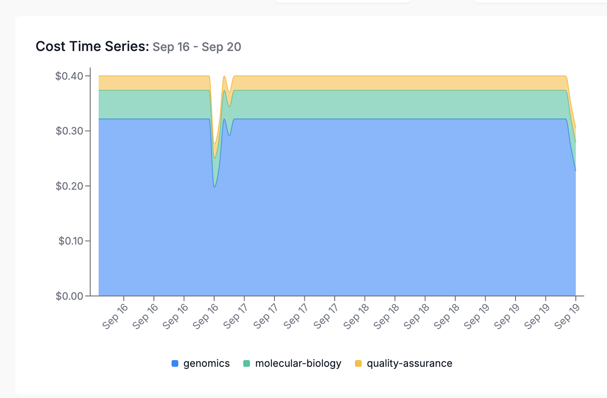

### Principles and Assumptions

In building out the dashboard, the following guiding design principles were followed.

#### 1. Clear visual hierarchy.

The dashboard's layout/hierarchy is structured with high-level information at the top, followed by increasing detail, which allows the user to drill down from the top as needed.
High-level KPI metrics, such as daily burn rate and projected monthly spend, give an immediate, high-level idea of the current spending.

Then, once the user scrolls down to the EC2 instances table, they see the hourly spend and cost efficiency per EC2 instance, with potentially a recommended action to reduce cost waste.

Lastly, the cost breakdown section supports grouping costs by different values, such as team and instance type, where a pie chart is used to display the total cost for each group and any unaccounted costs. In addition, an area chart has been picked to provide insight into cost over time for each group and potentially identify cost anomalies/spikes.

#### 2. The what and how of cost reduction should be clear

Wasting cloud resources should be avoided. Hence, we designed the dashboard to quickly provide answers to the following key questions:

- Is there any cloud waste?
- What actionable steps can I take to reduce waste?
- How much will I save by doing so?

#### 3. Smooth UI

Instead of using generic loading indicators such as spinners, we have opted for loading indicators that mirror the kind of information the user may expect upon successful loading. This allows for quick navigation to the relevant information, even if not everything has been loaded yet. It is also more user-friendly than a screen full of ambiguous spinners.
Lastly, care has been taken to reduce layout shifts, which significantly degrade the UX.

### What I didn't build

In terms of observability, I intentionally focused on the top layer, such as instances and left out deeper layers, such as pipelines and jobs. Doing the top layer well lays the foundation for further observability. By the time I finished the dashboard for the top layer, I didn't have time left to build out the deeper layers.
However, it is possible to group costs by team and project through the use of tags.

### UI screenshots

#### Overview of the dashboard

#### Cost-saving actions are shown as part of the EC2 instances table.

#### Cost breakdown by team.

Cost time series by team.

